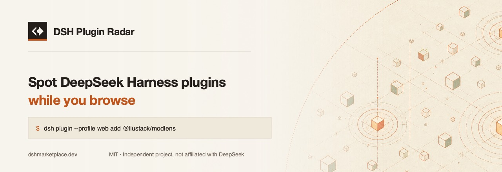

<p align="center">
  
</p>

<p align="center">
  <a href="https://greasyfork.org/scripts/591735-dsh-plugin-radar"></a>
  <a href="dsh-plugin-radar.user.js"></a>
  <a href="LICENSE"></a>
  <a href="https://dshmarketplace.dev/api/v1/index"></a>
  
  
  <a href="https://linux.do"></a>
</p>

<p align="center">
  <a href="README.md">English</a> · <b>简体中文</b>
</p>

---

一个油猴脚本：你在 GitHub 和 npm 上随便逛的时候，它把
[DeepSeek Harness](https://github.com/deepseek-ai/deepseek-harness)
插件标出来，顺手给你一条真能跑的安装命令。

## 为什么要有它

`dsh plugin add` 只是把活转发给 profile 目录里的 pnpm，所以 `--profile` 是**必填**的：

```console
$ dsh plugin add some-plugin
error: required option '--profile <name>' not specified
```

不少 README 还在写短的那种。这个脚本从
[DSH Marketplace](https://dshmarketplace.dev) 目录里取命令 —— 那边每条都带着这个
flag —— 直接放到你正在看的页面上。

## 它做什么

**GitHub 仓库页** —— 如果这个仓库是 DSH 插件，侧栏顶部会出现一张卡片：分类、这插件干嘛的、
带复制按钮的安装命令，以及它能碰到什么。

**任何列了一堆仓库的 GitHub 页面** —— topic 页、搜索结果、Star 列表、甚至一篇链了别的仓库的
README —— 每个指向目录内插件的链接后面都会跟一个小小的 `DSH` 标记。鼠标悬上去就是安装命令。

**npm 包页** —— 如果这个包是 DSH 插件，DSH 命令会出现在 npm 自己那句 `npm i` 上面。
`npm i` 装不进 harness 里。

**monorepo 里的插件，实话实说。** 想当然的那条命令是跑不通的：`dsh plugin add` 转发给
pnpm，pnpm 把 `#` 后面的东西当 git ref，`github:owner/repo#packages/thing` 会以
`Could not resolve packages/thing to a commit` 失败。卡片会直接说明这一点，而不是给你一条
跑不通的命令。

但确实**有**一种写法能解析：pnpm 会把 fragment 按 `::` 拆开，其中 `path:` 那段当子目录处
理，所以 `github:owner/repo#path:packages/thing` 是能装上的，已经端到端验证过。catalogue
现在还没开始发这种命令，所以卡片也不发。等它开始发了，这个脚本自动就有了 —— 命令是从 API
来的，不是写在这里的。

## 安装

1. 先装一个脚本管理器 —— [Tampermonkey](https://www.tampermonkey.net/)、
   [Violentmonkey](https://violentmonkey.github.io/)，Safari 用
   [Userscripts](https://apps.apple.com/app/userscripts/id1463298887)。
2. **[从 Greasy Fork 安装](https://greasyfork.org/scripts/591735-dsh-plugin-radar)**，
   或者直接打开 [`dsh-plugin-radar.user.js`](dsh-plugin-radar.user.js) 的 raw 文件，
   管理器会自己弹出安装。

### 用的不是 web profile

命令都是按 `web` 这个 profile 写的 —— 默认装 DSH 建出来的就是它。你要是叫别的名字，
在脚本管理器菜单里点一次 **设置 profile 名**，之后所有页面上的命令都会跟着改。

## 隐私

不往外发你的任何东西。

脚本只会去拉一个公开文件 —— `https://dshmarketplace.dev/api/v1/index`，一份插件名单 ——
最多六小时一次，匹配全在你自己浏览器里做。你访问了哪些页面，从来不会被传出去。没有账号，
没有追踪，没有埋点，除了那一个接口没有任何第三方请求。

缓存存在脚本管理器自己的存储里，随时可以从它的菜单清掉。

## 它读的那套 API

两个接口都是公开的，CORS 全开，随便用。

| 接口 | 用途 |
| --- | --- |
| [`/api/v1/index`](https://dshmarketplace.dev/api/v1/index) | 全部条目，五列，一个请求搞定 —— [示例](docs/example-index.json) |
| [`/api/v1/plugins?q=`](https://dshmarketplace.dev/api/v1/plugins?q=modlens) | 单个插件的完整记录 —— [示例](docs/example-plugin.json) |

`/api/v1/index` 用位置数组返回，为的是小 —— 现在这 3,417 个插件是 375 KB，压过去 68 KB ——
列名跟着 payload 一起发：

```json
{
  "fields": ["fullName", "category", "install", "path", "npm"],
  "plugins": [
    ["liustack/modlens", "vision", "dsh plugin --profile web add @liustack/modlens", "/plugins/liustack-modlens", "@liustack/modlens"]
  ]
}
```

装不上的时候 `install` 是 `null`，还没有独立页面的时候 `path` 是 `null`，没发包的时候
`npm` 是 `null`。这几个字段永远不会塞占位符 —— 拿到 `install` 就直接跑的调用方，不能被喂一条
会失败的命令。

## 拿它接着搭

没有构建步骤，没有依赖。就一个文件，从头读到尾，而且只会往 DOM 里追加它自己的节点。

同一份目录的其他入口：

- **网页** —— [dshmarketplace.dev](https://dshmarketplace.dev)
- **npm** —— `npx dshmarketplace-cli find memory`
- **PyPI** —— `pip install dshmarketplace`
- **DSH 里面** —— `dsh plugin --profile web add dshmarketplace-plugin`

## 参与

Issue 和 PR 都欢迎。如果是某个插件没被收录、或者条目写错了，那属于
[marketplace 仓库](https://github.com/DshMarketPlace/dshmarketplace)
或者[提交表单](https://dshmarketplace.dev/zh/submit) —— 数据在那边，不在这。

## 联系

- **社区** —— [LINUX DO](https://linux.do)
- **问题反馈** —— [GitHub Issues](https://github.com/DshMarketPlace/dsh-plugin-radar/issues)

## 致谢

- [**LINUX DO**](https://linux.do) —— DSH 生态实际上是在这里被讨论的，这个
  项目也在这里发布和收反馈。作者本人在 LINUX DO 发过帖的插件，在目录里会带
  一个认证标记。
- [awesome-dsh-plugin](https://github.com/awesome-dsh-plugin/awesome-dsh-plugin)
  （CC0-1.0）—— 目录的收录种子来自这里。

## 授权

MIT。独立项目，与 DeepSeek 无从属关系。
